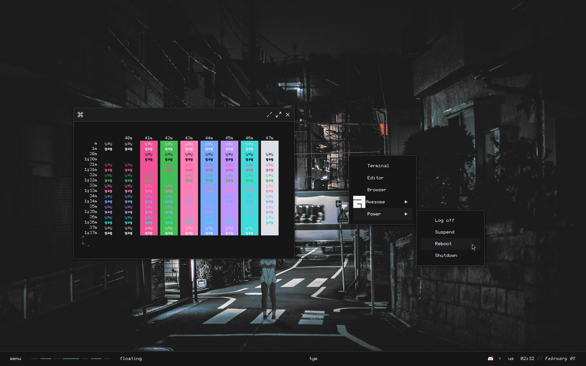

  <h1> Modular Default AWM </h1>

<h3> Wip </h3>
<table>
  <thead>
    <tr>
      <th style="text-align: center"></th>
    </tr>
  </thead>
  <tbody>
    <tr>
      <td>
        
      </td>
    </tr>
  </tbody>
</table>

*For previous config checkout the [main](https://github.com/re1san/Awe/tree/main) branch*

<h3> Credits </h3>

* Inspired from the design and modular configs of [gw's](https://github.com/Gwynsav) rices
* Also some stuff taken from [chadcat7](https://github.com/chadcat7)
 
