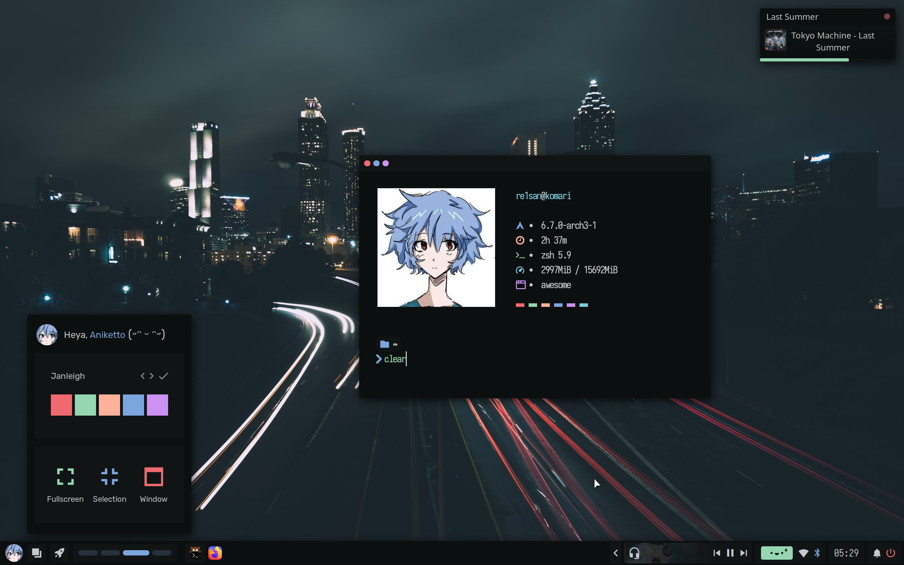
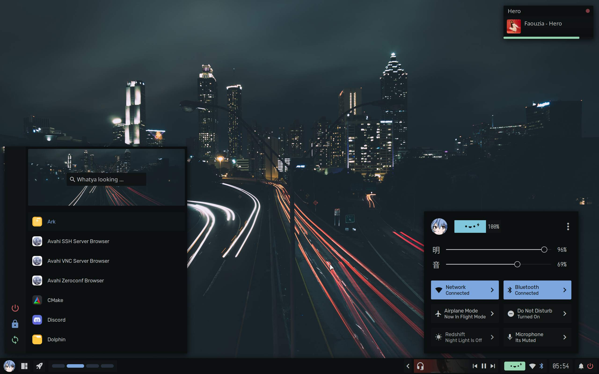
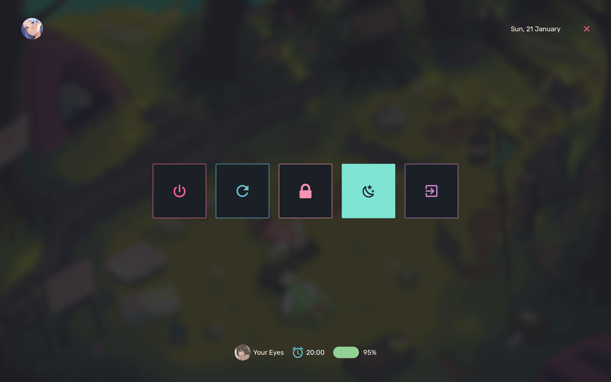

  <h1> Awe-Dots </h1>
  
 Aesthetic dots for AwesomeWM!?

> [!Note]
> Very Very Messy right now as it has lot of modules taken from others.

<h3> Showcase </h3>

<table>
  <thead>
    <tr>
      <th style="text-align: center">Kitty</th>
    </tr>
  </thead>
  <tbody>
    <tr>
      <td>
        
      </td>
    </tr>
  </tbody>
</table>
<table>
  <thead>
    <tr>
      <th style="text-align: center">Launcher</th>
    </tr>
  </thead>
  <tbody>
    <tr>
      <td>
        
      </td>
    </tr>
  </tbody>
</table>
<table>
  <thead>
    <tr>
      <th style="text-align: center">Exit screen</th>
    </tr>
  </thead>
  <tbody>
    <tr>
      <td>
        
      </td>
    </tr>
  </tbody>
</table>

<h3> Credits </h3>

Stole the configs from these awesome people :)
* [Chadcat](https://github.com/chadcat7)
* [Gwen](https://github.com/elythh)
